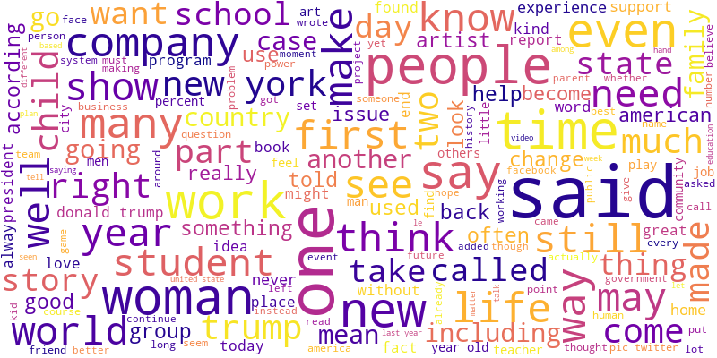

# Projet_DeepL

## Description
Ce projet consiste à développer une solution de traitement automatisé du langage naturel capable de lire et d'analyser les articles de journaux pour en extraire les thématiques principales. Cela permet de faciliter et d'accélérer le processus d'analyse des articles de journaux, en évitant la nécessité de les lire et de les étiqueter manuellement.

Pour ce faire, le projet utilisera des algorithmes d'apprentissage profond pour entraîner un modèle sur un grand corpus d'articles de journaux étiquetés extrait d’une compétition Kaggle.  

Nous avions initialement envisagé d'étendre le projet afin d'inclure d'autres fonctionnalités, comme l'extraction de citations importantes ou la génération de résumés automatiques des articles. Nous n'avons néanmoins pas eu le temps de développer ces fonctionnalités supplémentaires.

## Données utilisées
Nous n’avons travaillé que sur des datasets d’articles en anglais.
- News Article Category Dataset : Dataset d'un challenge Kaggle regroupant 6877 articles (titre, corps et categorie) postés sur le site du Huffingtion Post
- Articles sharing and reading from CI&T DeskDrop : 3k articles shared in the company internal tool

Un version pré-traitées du premier dataset est stockées dans le csv news-article-categories-clean. 
Les transformations suivantes ont été appliquées:
- Conservation des caractères alphabétiques uniquement
- Suppression des stopwords
- Lemmatisation 

## How to Run
Executer les notebooks.
Pour les notebooks dans le dossier LDA, il est recommandé de créer un nouvel environnement virtuel (La première céllule propose de télécharger les librairies avec pip).

## Notebooks
### 00 exploration
Notebook d'exploration du dataset Kaggle
- Observation des catégories et de la répartition des articles

- Création et sauvegarde d'un nuage de mot

- Premiers tests de tokenization

### 01 TFIDF
Notebook regroupant nos premières approches de topic modeling à l'aide de modèles de Machine Learning classique.
- Partie préprocessing du texte des articles et création d'un dataset "clean" (cette partie est commentée dans le notebook car met beaucoup de temps à s'exécuter). Le dataset traité est sauvegardé dans un csv.
- Creation d'une matrice TFIDF à partir des articles 
- Prédiction des topics
    - Naive Bayes

    

    - K-NN

    

    - Decision Tree
    - Random Forest

    

    - Logistic Regression

    

### 02 Gensim LDA 
Notebook utilisé pour nos premiers tests sur Gensim.
- Calcul de la longueur des articles
- Profile Report
- Tokenization
- Loi de Zipf

- Topic Modeling par LDA à l'aide de la bibliothèque Gensim

### 03 RNN
Implémentation de RNN pour la classification des articles.

Plusieurs tests on été réalisés avec:
- Un RNN simple à 3 couches cachées
- Une succession de 3 RNN à 3 couches cachées 

Les deux modèles marchent, mais avec plus de temps nous aurions pu tester plus d'hyperparamètres afin d'améliorer la précision.

### 04 Transformers
Utilisation de la librairie Transformers de Hugging Face.
- BART
- BERT
- DistilBERT
BERT et DistilBERT ne sont pas encore abouti. Il aurait également fallu fine-tuner BART afin d'obtenir de meilleurs résultats.

## LDA Folder

Une implementation plus poussée du modèle LDA est disponible dans le dossier LDA : Notebooks LDA/LDA_original.ipynb et LDA/LDA_applied.ipynb
Nous avons rajouté des paires de mots dans le dictionnaire afin de pouvoir retrouver des thématiques sur 2 mots (Silicon Valley, social media, ...).

Pour télécharger gensim, il est conseillé de créer un environnement virtuel car la version de numpy utilisée est spécifique.
Il suffit de lancer la première cellule de code dans LDA_applied.ipynb ou LDA_original.ipynb

Cette partie a été inspirée par ce projet kaggle : https://www.kaggle.com/code/gspmoreira/deskdrop-articles-topic-modeling.
